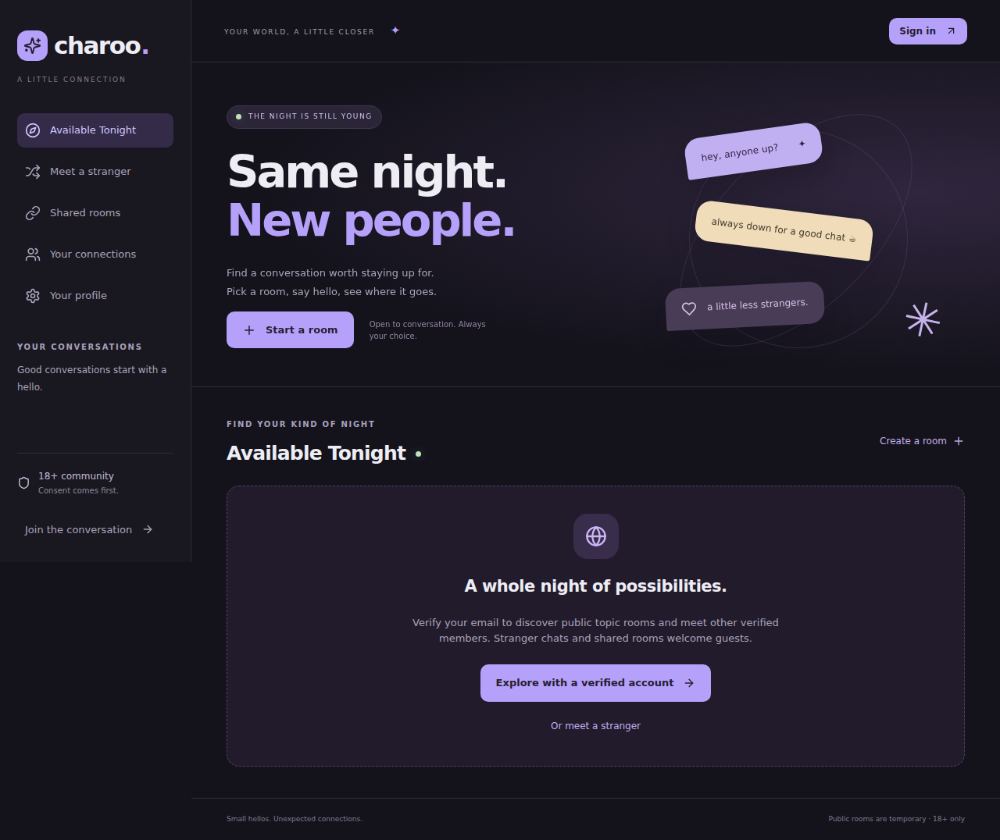
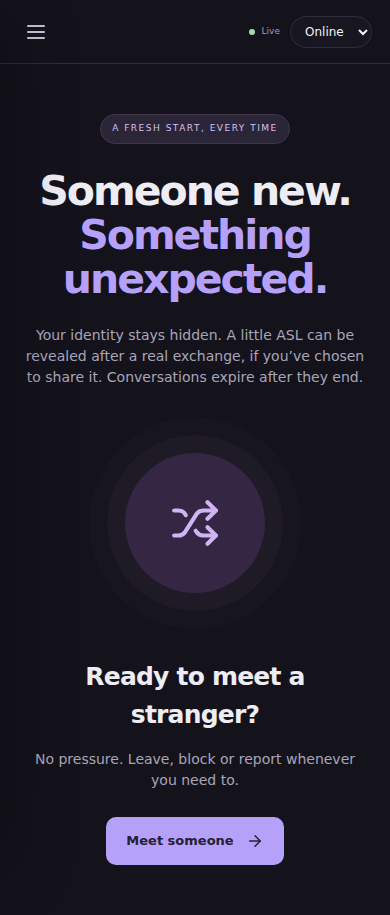

# Charoo

An installable, responsive PWA for ephemeral stranger chat and social discovery, built from the supplied product plan.

**This is a runnable MVP implementation for review, not a production launch certification.** Core text-chat flows work without paid providers. Email needs SMTP. Media, video and AI require the integrations described below and default to unavailable until configured.

## Start locally with Docker

Requires Node.js 22.22+ and Docker Compose.

```sh
npm ci
npm run setup
docker compose up --build
```

Open **http://localhost:3000**. Email sign-in links appear in local Mailpit at **http://localhost:8025**. Accept the 18+ community acknowledgement to enter as a guest, or use email sign-in to become verified. Email verification confirms mailbox control; it is not government-ID or age verification.

`npm run setup` creates an ignored `.env` and generates the mandatory 32-byte message encryption key. It keeps existing values. Never commit `.env` or replace the encryption key while stored messages still need to be readable.

The Compose configuration is **local development only**: loopback ports, test credentials, HTTP and Mailpit. For production, use HTTPS, `NODE_ENV=production`, a precise `WEB_ORIGIN`, managed secrets, authenticated private PostgreSQL/Redis, and your SMTP provider.

## Develop outside the API container

```sh
docker compose up -d postgres redis mailpit minio
npm run db:migrate
npm run dev
```

Open **http://localhost:5173**. The example `.env` uses this origin, and Vite proxies REST and WebSockets to port 3000. The API and its cleanup jobs run together as one modular application. `npm run build` creates the frontend bundle; the API serves that bundle in the Docker image.

## Verify

```sh
npm run typecheck
npm test
npm run build
npx playwright install --with-deps chromium
npm run test:browser
npm audit --omit=dev
```

Backend tests use the PostgreSQL engine through PGlite and an injected ephemeral-state adapter. WebSocket tests exercise real network connections. Browser tests use the same API and gateway with test adapters, including a real guest room/message flow and mobile viewport checks. They do not certify external SMTP, S3 scanning, LiveKit, LLM integrations or horizontal Redis fan-out. CI runs type checks, backend tests, build and browser smoke tests.

## What is implemented

- Server-issued, HTTP-only guest sessions, email-link sign-in, one-use expiring verification tokens, session rotation, and guest upgrade without changing its identity.
- Adult acknowledgement, profiles and visibility controls, approximate region, configurable temporary availability and Redis presence.
- Stranger matching with a Redis queue, PostgreSQL transaction fencing, duplicate/self/block/recent-match checks and bounded candidate scans.
- Balanced ASL reveal after configured qualifying participation and elapsed duration. Short, repetitive and rapidly sent messages do not force reveal; ASL remains subject to profile visibility.
- Verified-only public Available Tonight discovery with categories, tags, search, cursor pagination, public topic rooms, and scoped feed invalidation. There is no global participant cap.
- Separate unlisted, expiring groups with cryptographically random links stored as hashes, optional verified-only joining, and no public listing.
- Authorized WebSocket text messages, acknowledgments, typing, REST fallback, idempotency, history, replies, heart reactions, read events, reconnect recovery and retry UI.
- Consent-based private requests, mutual saved contacts, contact removal, free reconnect requests, and blocking.
- Report submission, owner mute/remove/close/edit/slow mode, staff report review, scoped reported-message evidence access, room closure, suspension, bans, roles and audit records.
- Server-side expiry, encrypted message cleanup, persistent object deletion retries and cleanup of unused expired guest identities.
- S3 quarantine/approved-object upload adapter, a fail-closed scanner contract and authorized short-lived attachment downloads.
- Consent-based private LiveKit calls and a provider-independent AI suggestion endpoint with no automatic sending or transfer of conversation history.
- PWA manifest/icons, static-shell offline caching, responsive desktop/mobile UI, install affordance and optional notifications while the app is open.
- Docker, local PostgreSQL/Redis/Mailpit/MinIO services, migrations, CI, JSON operational errors, request IDs and health checks.

## Administration

Verify an email account first. Grant its role from an operator shell; users cannot grant themselves roles.

```sh
# With the host development setup:
npm run admin:grant -- moderator@example.com MODERATOR

# With the local Compose API:
docker compose exec api node --import tsx apps/api/src/grant-admin.ts admin@example.com ADMIN
```

Open **/admin** or select **Moderation**. `SUPPORT` reads the dashboard, report metadata and room metadata. `MODERATOR` can review reported message evidence, resolve reports, close rooms, suspend regular users for 24 hours and ban regular users. `ADMIN` additionally updates settings and reads the audit trail. Actions against staff accounts require an operator. There is no hardcoded default administrator.

## Provider setup

See [provider contracts](docs/providers.md). Leave optional providers disabled until integration tests pass in your deployment.

- **Email:** set `SMTP_URL` and `EMAIL_FROM`. Local Compose uses Mailpit; production needs a real sender and verified domain.
- **Storage:** configure `S3_*`, create a private bucket and enable storage encryption. `S3_PUBLIC_ENDPOINT` must be reachable by browsers/scanners and match the presigned host. Local MinIO exposes its console on port 9001; create the `charoo` bucket there.
- **Media:** set an authenticated `MEDIA_SCANNER_URL` and `MEDIA_SCANNER_TOKEN`. Implement and verify the scanner contract; no bundled antivirus service is claimed.
- **Video:** configure LiveKit URL/key/secret and enable `video_enabled` through admin settings. LiveKit must provide working TURN/STUN and suitable room authorization.
- **AI:** configure the compatible provider endpoint, key and model and enable `AI_assistant_enabled`. Suggestions never send automatically. Output safety evaluation is a launch prerequisite.

## Design and remaining work

Read [architecture](docs/architecture.md) and [launch follow-up](docs/launch-follow-up.md) for state machines, schema, security decisions, deployment boundaries and the features not completed in this first implementation.




