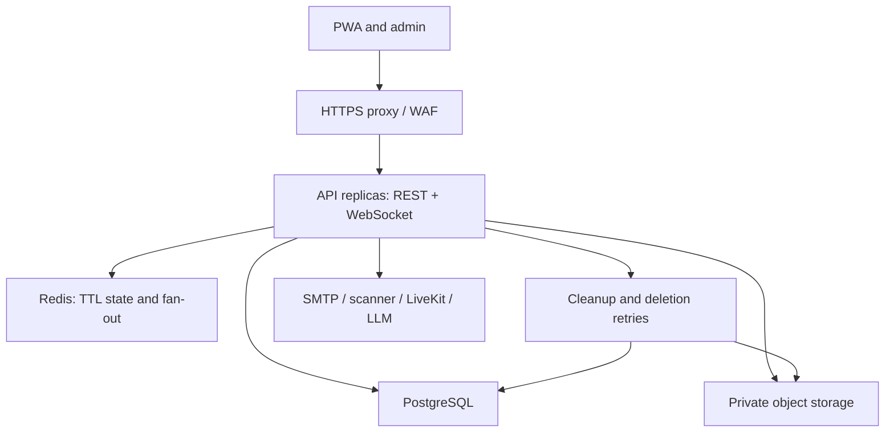
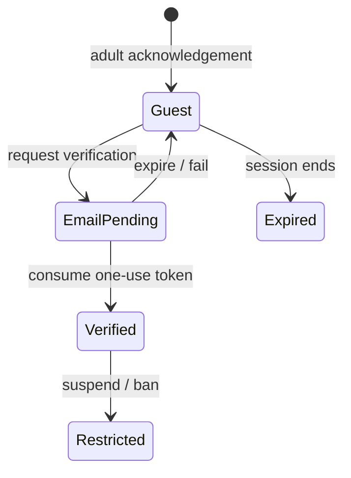
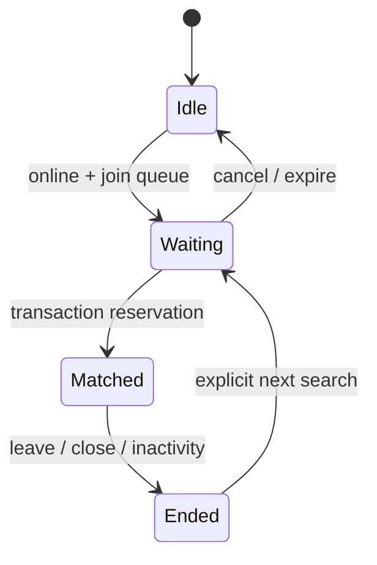
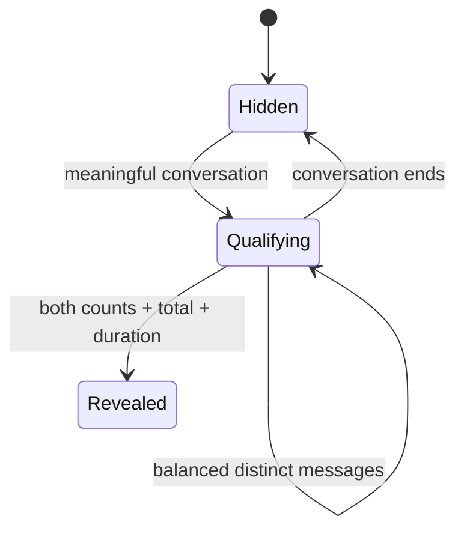

# Charoo MVP architecture

## Decision summary

A TypeScript modular application serves an installable React client and a role-protected admin surface. PostgreSQL owns sessions, identities, room memberships, messages, moderation and relationships. Redis holds expiring presence, availability, matchmaking candidate ordering, limits and transient fan-out. Private S3 storage holds scanned media. Configured SMTP, LiveKit and an existing LLM are optional external providers.

The product has distinct room policies: `STRANGER`, `PRIVATE`, `CONTACT`, `AVAILABLE_TONIGHT` and `SHARED_GROUP`. Public discovery queries only `AVAILABLE_TONIGHT`; an unlisted group's link hash is never returned through listings. A public room does not grant permission for private messaging, contacts, calls or meeting in person.

| Decision                               | Reason                                                                                                     | Alternative / tradeoff                                                        | Change trigger                                                                                     |
| -------------------------------------- | ---------------------------------------------------------------------------------------------------------- | ----------------------------------------------------------------------------- | -------------------------------------------------------------------------------------------------- |
| React + TypeScript + Vite PWA          | This authenticated app does not require SSR for its initial flows; one static bundle simplifies deployment | Next.js adds server rendering and conventions but another runtime surface     | Public landing/search pages need SSR or SEO                                                        |
| Express TypeScript modular application | Small initial runtime, shared schemas and easily injected database/realtime adapters                       | NestJS provides stronger module/DI conventions at more initial structure cost | Team size or route complexity justifies explicit framework modules                                 |
| PostgreSQL for durable state           | Transactions, unique constraints and indexes enforce critical invariants                                   | Document storage adds complexity to relational consent/membership checks      | A measured workload needs specialized read models                                                  |
| Redis for short-lived state            | TTLs, indexed sets, counters and pub/sub avoid heartbeat database writes                                   | In-process state loses presence across replicas                               | Redis failure behavior requires stronger recovery or a durable event bus                           |
| WebSockets + REST                      | One primary duplex channel with reliable persisted-history recovery                                        | Separate SSE would duplicate discovery transport in this build                | A distinct read-only stream has an operational advantage                                           |
| Server-readable AES-256-GCM            | Supports authorized history and reported-message review without plaintext storage                          | E2EE changes moderation, multi-device keys and recovery substantially         | A separately designed cryptographic E2EE product requirement                                       |
| LiveKit adapter                        | Avoids implementing an SFU and media infrastructure                                                        | Custom WebRTC signaling still requires TURN and substantial operations        | Provider costs or capabilities justify replacement                                                 |
| Jobs inside the API process            | Minimal deployment complexity for one-minute cleanup                                                       | BullMQ/dedicated workers offer stronger queue separation                      | Email/scanning workload needs asynchronous queues, retry scheduling or independent worker capacity |
| No payments                            | Reconnect remains free, with explicit request/consent boundaries                                           | Paid entitlements require billing and refund handling                         | Pricing is specified and payments are actually required                                            |

## Topology

The first deployment can use one API replica with managed PostgreSQL/Redis. All replicas share the same databases and encryption secret. Redis pub/sub carries **IDs and invalidation events**, not plaintext private messages. Clients fetch authorized content from PostgreSQL after notification. Lost pub/sub events are recovered from durable history when reconnecting. These are at-least-once invalidations, not exactly-once network delivery.

## Code boundaries

| Boundary                   | Location                                 | Responsibility                                                                       |
| -------------------------- | ---------------------------------------- | ------------------------------------------------------------------------------------ |
| Shared contracts           | `packages/contracts/src/index.ts`        | Input schemas, room types, default settings, UI/API types                            |
| Durable schema             | `packages/database/001_initial.sql`      | Tables, constraints, indexes and migration version                                   |
| HTTP identity and commands | `apps/api/src/app.ts`                    | Sessions, origin/CSRF policy, validated endpoint boundaries, admin authorization     |
| Domain services            | `apps/api/src/domain.ts`                 | Membership, matching, qualified messages, consent helpers, retention                 |
| Realtime infrastructure    | `apps/api/src/realtime.ts`, `gateway.ts` | Redis adapter, authenticated WebSockets, subscriptions, fan-out/backpressure         |
| Provider adapters          | `apps/api/src/providers.ts`              | Storage/scanning, private video tokens, generic AI suggestions                       |
| Operational startup        | `apps/api/src/server.ts`                 | SMTP, HTTP/static app serving, cleanup, shutdown                                     |
| Encryption                 | `apps/api/src/crypto.ts`                 | CSPRNG tokens, token hashes, authenticated ciphertext and keyed message fingerprints |
| PWA                        | `apps/web`                               | Responsive flows, explicit consent UI, recovery, static offline shell                |
| Admin                      | `/admin` in the same PWA                 | Dedicated staff route with server-authorized actions                                 |

This first implementation shares the frontend shell between PWA and admin. It does not provide a separately built `apps/admin` deployment. As the route surface grows, split HTTP route registration by domain and extract UI panels from the initial app component; those are maintainability follow-ups rather than independent microservices.

## PostgreSQL schema and indexes

The migration is authoritative. All durable identifiers are random UUIDs, not incremental URL identifiers. Timestamps use UTC with millisecond precision so composite API cursors round-trip without losing database microseconds.

| Tables                                                   | Persistent responsibility                                                                                        |
| -------------------------------------------------------- | ---------------------------------------------------------------------------------------------------------------- |
| `users`, `sessions`, `email_tokens`                      | Guest/verified identities, profile visibility, roles, account restrictions, expiring hashed credentials          |
| `rooms`, `participants`                                  | Room policy, lifecycle, secure-link hash, membership/removal, mutes, ASL counts, read timestamps                 |
| `messages`, `reactions`, `message_fingerprints`          | Encrypted messages, reply references, per-sender idempotency, reactions and keyed distinct-message qualification |
| `blocks`, `social_requests`, `contacts`, `match_history` | Two-way block checks, explicit acceptance, mutual contacts, recent-match avoidance and free reconnect            |
| `attachments`, `object_deletions`, `calls`               | Media approval, persistent deletion retry and private call consent/lifetime                                      |
| `reports`, `audit_logs`, `settings`, `schema_migrations` | Report review, staff/owner audit, validated business rules and migration fencing                                 |

Key indexes include discovery `(created_at,id)`, expiry/purge schedules, membership by user, message history `(room_id,created_at,id)`, pending requests, one active call per room and recent match pairs. Idempotency is a unique constraint on `(room_id,sender_id,client_message_id)`. Shared link hashes and verified email addresses are unique. A contact pair is stored in canonical UUID order.

## Redis model

| Key                      | Structure / lifecycle                                                        |
| ------------------------ | ---------------------------------------------------------------------------- |
| `presence:{userId}`      | String; 90-second TTL; heartbeat about every 25 seconds                      |
| `available:{userId}`     | String; configured hours; not extended by heartbeats                         |
| `match:queue`            | Sorted set ordered by queue time; bounded scans, no wildcard queries         |
| `match:waiting:{userId}` | 90-second TTL, refreshed while actively waiting                              |
| `room:{roomId}:online`   | Sorted set of heartbeat times; count trims stale members; 120-second key TTL |
| `limit:{scope}`          | Atomic Lua counter plus fixed expiry                                         |
| `charoo:events`          | Redis pub/sub for scoped invalidations and user-targeted events              |

Redis is not authoritative for messages, membership or bans. Admission checks re-read PostgreSQL. When Redis is unavailable, requests fail rather than silently falling back to isolated per-instance state. Restore Redis connectivity before resuming matching. Pub/sub handler failures must not leak message content.

## Identity state

Guest identities use server-issued random tokens with hashes stored in PostgreSQL, HTTP-only SameSite cookies and CSRF tokens. Production requires secure cookies and HTTPS. Verification tokens are one-use and expire in 15 minutes. Upgrading a new email preserves the guest's user ID and invalidates its existing sessions. Signing into an already-verified email uses that verified identity after proving mailbox access; it does not merge another guest's history into it.

Profiles never expose email or precise coordinates in public APIs. The app collects optional age/gender/region fields and requires self-attested adulthood. This is not strong age assurance. UI anonymity means profile fields and display name are hidden during stranger introductions; opaque user IDs are still used by authorization/reporting and are not unlinkable cryptographic pseudonyms.

## Matching state

A transaction-scoped PostgreSQL advisory lock serializes match reservations across replicas. Within it, matching checks the user's existing active stranger conversation, current TTL state, account restrictions, counterpart's existing match, self-match, blocks and recent pair history. It creates both participants and the conversation transactionally, then removes queue entries and publishes targeted match events after commit. Cancellation uses the same lock, preventing a successful cancel from racing a later reservation under that lock.

The MVP favors oldest waiting candidates among the first 200 and does not claim an advanced random-interest recommender. Bounded scanning, a global reservation lock and polling are deliberate first-version limits. Partition candidates and locks by language/region when measurements show throughput or fairness problems. Database constraints remain the final defense against duplicate durable records.

## ASL state

A qualifying message needs at least eight normalized characters, four distinct characters, three seconds since that user's last qualifying message and a previously unseen keyed fingerprint within that conversation. Only new persisted messages affect counts; retries do not count twice. Default reveal needs ten qualifying messages each, twenty total and at least 120 seconds. The server serializes room-message updates to avoid count races.

Revealing eligibility does not override profile choices. `private` remains hidden, `contacts_only` requires a saved contact, and `public` is visible after the stranger threshold or in eligible rooms. Region is approximate text, never coordinates. Anti-spam heuristics are not bot-proof; risk scoring and moderation evaluation remain follow-up work.

## Conversations and retention

Public topic rooms default to a twelve-hour maximum creation lifetime; shared groups default to twenty-four hours. Requested durations cannot exceed configured room policies. Creator/moderator closure or server-clock expiration immediately prevents reads/writes/joins. Cleanup runs every minute and emits closure events.

Stranger/private conversations close after configured inactivity (24 hours by default) or explicit leave. Closed room data is scheduled for purge after the configured conversation retention interval. At purge, messages, reactions, fingerprints and memberships cascade, attachment keys enter the durable deletion queue, and storage deletion retries until successful. Persistent contact conversations are not given an automatic inactivity expiry in this first version; contact removal closes them. Unused expired guests are deleted after their remaining room/message references disappear.

There is no plaintext backup database. Use encrypted PostgreSQL backups with bounded retention and encrypted object storage. Backup restore must immediately run retention cleanup before making restored conversations accessible. Reports keep reasons and references; message evidence disappears with normal expiry. Separate legal holds, evidence preservation and account deletion/export are not implemented.

## Discovery and groups

The Available Tonight hub loads thirty public rooms per page through REST, ordered by creation time and UUID. Search uses PostgreSQL `ILIKE` over bounded room fields. Category filtering is exact. Only verified online users with no active restriction may browse/create/join. The status “Available Tonight” is optional; all eligible online verified members may enter a public room.

WebSockets deliver lightweight feed invalidation only when the client subscribes to discovery. Joining a particular room subscribes to its message invalidations separately. The server never subscribes the entire hub to every room's chat. Participant presence is represented by counts, not a full stream of every other user's heartbeat. The current participant panel shows the first 100 members; full participant pagination is follow-up work.

Unlisted rooms have a 256-bit random link token, stored as a SHA-256 hash. Initial owner membership is automatic; further membership requires possession of the link and verification if enabled. Removed members cannot rejoin through the same link. Listings return neither raw link tokens nor their hashes. Link revocation/rotation, passwords and approval queues are future controls.

## REST and WebSocket responsibilities

REST covers auth, profiles, history, paging, availability, room creation/join, explicit requests, reports, settings, attachment authorization and fallback message submission. Every payload and path identifier is validated and session mutations require both trusted origin and CSRF.

WebSockets use the same cookie identity, check the exact browser Origin and revalidate the session/account for events and deliveries. Subscriptions authorize current membership and room policy. Messages accept a client UUID and persist through the same domain service as REST. Typing is rate-limited and transient. Reconnect restores authorized history; the browser retries an unacknowledged send through REST with its original UUID. Backpressure closes slow sockets after the output buffer crosses 256 KB, allowing durable history recovery rather than growing unbounded buffers.

## Encryption and secret handling

Message bodies use AES-256-GCM with fresh nonces and the room ID as authenticated associated data. A separately supplied 32-byte `MESSAGE_KEY` is mandatory, including development. Distinct-message fingerprints use HMAC with that key. No plaintext messages, verification/session tokens, keys or exact location are logged.

This is **server-readable encryption at rest, not E2EE**. The initial implementation uses one deployment secret and no key versioning/envelope-KMS rotation. Production key rotation must first add versioned keys and migrate ciphertext; replacing the current secret destroys access to existing messages. A KMS envelope design with per-conversation keys is a priority production follow-up.

## Consent and moderation

Private requests, contact requests and reconnect requests are recipient-approved, expire after 24 hours, and cannot override blocks. Contacts are mutually accepted. Reconnect is free and uses match history; expiry never restores deleted messages. Requests do not grant permission to video calling.

Owners can edit their group, change slow mode, mute for 30 minutes, remove members or close their room. They cannot set platform roles, ban users globally, or inspect another room. Staff roles are granted only by an operator and every staff command is permission-checked server-side. Moderator/admin reported-content access is restricted to an existing report and audited. Support can inspect metadata without message evidence or write powers.

## Threat model and operational limits

| Threat                               | Current control                                                                      | Follow-up                                                                           |
| ------------------------------------ | ------------------------------------------------------------------------------------ | ----------------------------------------------------------------------------------- |
| Forged identity / stolen credentials | Server-issued tokens, hashed storage, session rotation/revocation, HTTPS requirement | Device/session UI, risk signals and stronger age assurance                          |
| XSS / input injection                | React escaped text, bounded shared schemas, CSP, parameterized SQL                   | CSP/report monitoring and independent review                                        |
| CSRF / cross-origin use              | Exact Origin checks, SameSite cookie, per-session CSRF                               | Test reverse-proxy header behavior in deployment                                    |
| IDOR / stale memberships             | Membership, block, room-clock and role checks on both transports                     | Public-room participant privacy review                                              |
| Message retry races                  | Unique idempotency constraint and transactional room updates                         | Load test across replicas with real Redis/PostgreSQL                                |
| Queue abuse                          | Atomic reservation, duplicate-match checks, TTLs and limits                          | CAPTCHA/device signals, sharded matching, fair/random ranking                       |
| Upload abuse / overwrite             | Quarantine, scanner contract, separate approved object, limited download URLs        | Deploy scanner, orphan reconciliation, bucket lifecycle and encryption verification |
| Harmful public topics / scam links   | Room creation limits, reports, owner controls and moderation                         | Automated room-title/link screening and staffed response process                    |
| Video after consent withdrawal       | Call state, membership checks on token issue, ended-room cleanup                     | Verify immediate provider media revocation on block/ban/closure                     |
| Misleading AI output                 | Fixed input style, no peer history, no automatic send                                | Provider output moderation and safety evaluation                                    |

The edge WAF, production TLS, reverse-proxy WebSocket upgrade configuration, secret manager, backups, storage encryption and staffed moderation are deployment responsibilities. The API currently identifies rate-limit IPs from the direct peer; behind a proxy, set and test `TRUST_PROXY_CIDRS` to the explicit proxy source IPs/CIDRs rather than enabling arbitrary forwarded headers.

Health checks probe PostgreSQL and Redis. Operational errors are structured with request IDs and sanitized codes. Full metrics, distributed tracing, retention queue dashboards and error tracking are future instrumentation. Database query counts and Redis event volume require load testing before claiming support for thousands of concurrent users.

## Deployment and roadmap

Use the Docker image behind HTTPS with private PostgreSQL/Redis networks, a real SMTP sender, a private encrypted S3 bucket, provider secrets and the same encryption key across replicas. Run versioned migrations before serving traffic. The local Compose file is an example development environment, not a hardened production template.

| Subsystem              | First-build complexity | Next priority                                                        |
| ---------------------- | ---------------------- | -------------------------------------------------------------------- |
| Identity and profiles  | Medium                 | Real SMTP integration, account lifecycle and age policy              |
| Text chat and matching | High                   | Concurrency/load tests, fair ranking and queue partitions            |
| Public/unlisted rooms  | Medium                 | Participant pagination and scoped count coalescing                   |
| Safety and admin       | High                   | Automated topic/link screening, staff operations and evidence policy |
| Media                  | High                   | Implement scanner deployment, lifecycle and provider tests           |
| Contacts/reconnect     | Medium                 | Race tests and relationship lifecycle hardening                      |
| Video                  | High                   | Real-device TURN/permission/revocation tests                         |
| AI suggestions         | Medium                 | Output moderation and opt-in provider evaluation                     |
| Production operations  | High                   | KMS rotation, metrics, tracing, disaster recovery and load testing   |

Payments, subscriptions, group video conferences, custom SFUs, E2EE, custom fine-tuned AI, Elasticsearch, microservices and complex recommendations are postponed. The next release should close the documented launch blockers before enabling public media/video/AI or advertising production-scale support.
